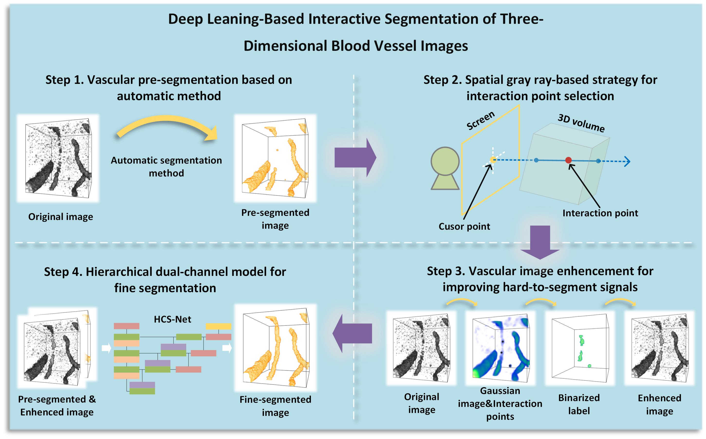

# iVesseger Framework
This repository contains the code for the paper "**Deep Leaning-Based Interactive Segmentation of Three-Dimensional Blood Vessel Images**". As a deep leaning-based interactive vascular segmentation framework, the iVesseger employs mouse-click operations to select regions in 3D space, guiding neural networks to correct any erroneous segmentation results. iVesseger comprises four steps: vessel pre-segmentation, interaction point selection, vascular image enhancement, and fine iterative segmentation. 

 
 

# Procedure
The specific steps for using iVesseger are as follows:

  **step 1.** Make sure the Pytorch, PyQt, and VTK are included in the coding environment，the package version is:
  
    PyQt5 - 5.15.5
    PyTorch - 1.12.1
    VTK - 9.2.6
    
  **step 2.** Implementation Platform & External Tools:
  
    PyCharm - 2022
    pyUIC & QT Desinger
    
  **step 3.** Run the ***pyqt_vtk.py*** to start the program.Four parameters need to be set before running:
  
    Two parameters are set in thick_detect.py:
      # Pre-segmentation with 3D U-Net by default
      net = UNet3D(1, 1, 64, layer_order='cbr')
      # Import model parameters (We provide the training parameters of U-Net, called "U_Net.pth")
      model_path = 'logs/thick_seg/U_Net.pth'
    
    Two parameters are set in refine_detect.py:
      # Fine-segmentation with HCS-Net by default
      net = HCS_Net(2, 1, image_size)
      # Import model parameters (We provide the training parameters of HCS-Net, called "HCS_Net.pth")
      model_path = 'logs/refine_seg/HCS_Net.pth'
    
  **step 4.** Click on the ***Load image*** button in the left interface to import data. We provide a data block for testing(named ***"test_image.tif"***).
    
  **step 5.** After data importing, use the Max slider and Min slider to adjust the brightness of the original image. The initial values of the Min-slider and Max-slider default to the maximum and minimum gray values in the original image.
    
  **step 6.** Click on the ***PreSeg*** button in the left interface to generate the pre-segmentation result.
    
  **step 7.** Interaction point selection process: 

    In single-ray mode:
      Left-click to adjust the viewing angle
      double left-click to generate interaction points
      right-click to eliminate erroneous interaction points
   
    In cross-ray mode:
      Left-click to adjust the viewing angle
      double left-click to generate interaction rays
      right-click to eliminate erroneous interaction rays

    
  **step 8.** After point selection, click on the ***Seg*** button in the left interface to generate the fine segmentation result.
    
  **step 9.** Repeat the point selection and fine segmentation process to optimize the segmentation result.
    
  **step 10.** Click on the ***Save Label*** button in the left interface to save the segmentation result.
    
  **step 11.** The checkbox at the bottom is used to select single-ray or cross-ray mode.

